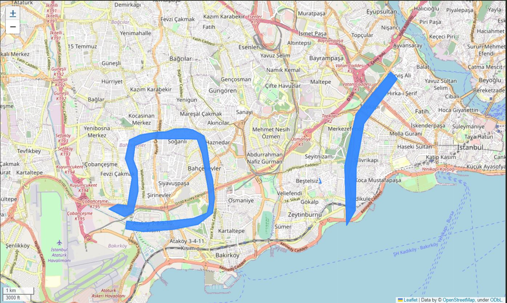
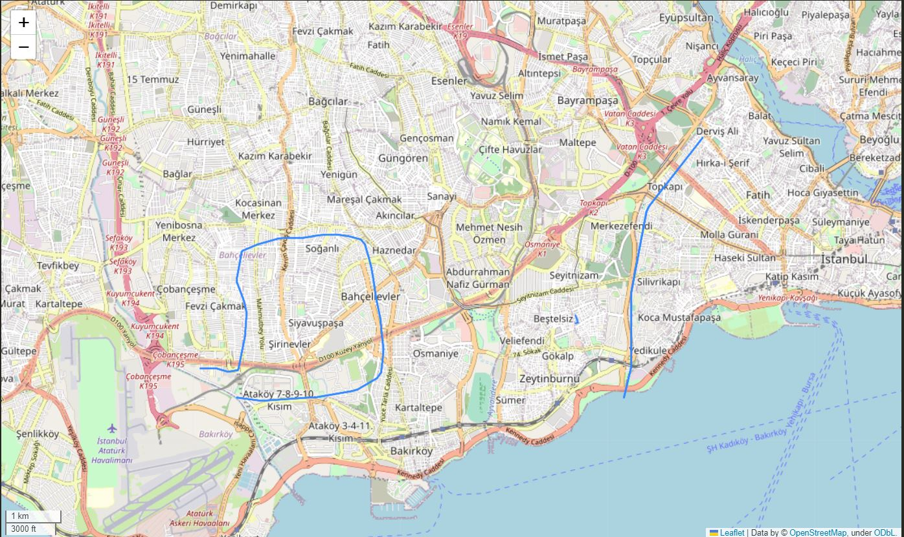

# FastApi-PostGIS-PolygonToCenterLine

CityEngine programında veriye dayalı kural bazlı modelleme çalışırken yol orta hat verisine ihtiyacım oluyordu. İmar planı kararlarını CityEngine programında rule yazarak gelecekte oluşacak dönüşümü göstermek için yol verisi önemliydi. Çünkü sokağa bakan cephelerde değişik plan kararları alınıyordu.

İmar planları sayısal verilerinde(genellikle NetCAD yazılımında çiziliyor) yol orta hat bilgisi bulunmuyordu. Biraz araştırma yaptıktan sonra POSTGIS'te bununla ilgili bir fonksiyon olduğunu keşfettim. Fonksiyona [buradan](https://postgis.net/docs/ST_ApproximateMedialAxis.html) ulaşabilirsiniz.

Daha önceki projelerimde Django ile uygulamalar yapıyordum. FastAPI inceledikten sonra hızlı kodlama ve performansı dikkatimi çekti. SqlAlchemy ve  GeoAlchemy kullanarak FastAPI ile çok iyi uygulamalar yapabilirsiniz. POSTGIS'te çözdüğüm sorunu basit bir uygulamaya dönüştürmek istedim. Uygulama iki bölümden oluşuyor:
 - Polygonların eklendiği tablo
 - Polygonların ortasından geçen çizgiyi hesaplayan ve GeoJson formatında veri döndüren sql sorgusu

**Örnek:**

Polygon

- 

Line

- 
